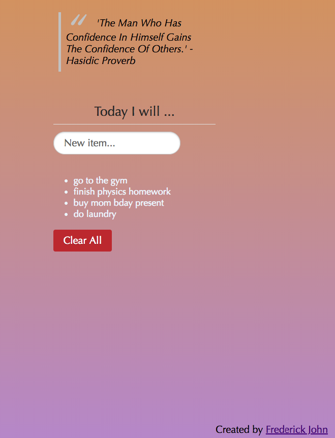

# ToDo List Application

This is a simple application that uses the local storage API
to save todo items. Items will persist even after the page refreshes
or the window closes. Add items from the input field, clear local
storage with the "Clear All" button.

### Screenshot

